# Inhibitor Operational Benchmark Report

## 1. Executive summary

The live Inhibitor `/check` API version
**2.24.1**
was evaluated with a configurable progressive burst-concurrency protocol
using paired Insight and Performance requests.

### Run outcome

- **Protocol status:** completed
- **Inhibitor version tested:** 2.24.1
- **Configured trials:** 1
- **Tested concurrency:** [1, 20, 50, 100, 200]
- **Scored requests:** 742 successful of 742 attempted (100.00%)
- **Configured response anomalies:** 0
- **Recovery probe:** failed

### Interpretation

This run contains one contributing trial. The results are descriptive and validate the benchmark workflow, but they do not establish repeated-run reliability or production capacity.

The observed results support statements about transport reliability,
response-shape consistency, measured latency and throughput, and
short-window post-burst responsiveness under this protocol. They do not
establish the service's maximum sustainable capacity or a production
service-level objective.

### Deterministic findings

- The highest median successful throughput observed was 16.52 requests/second at concurrency 200 for Insight and Performance modes.
- The highest aggregate successful stage throughput observed was 33.03 requests/second at concurrency 200 in trial 1.
- Insight 95th-percentile successful latency was 4662.60 ms at concurrency 20 and 5443.24 ms at concurrency 200.
- 0 transport failures were recorded across 742 attempted scored requests.
- 0 transport-successful responses contained one or more configured anomalies.
- Recovery probe status recorded: failed.
- No formal acceptance threshold was configured for latency, throughput, transport success, or anomaly rate.

No infrastructure prescription is inferred directly from these
measurements.

## 2. What this run supports

This benchmark provides evidence about:

- successful-response latency distributions;
- successful and attempted throughput;
- transport and API-response reliability;
- configured response-shape anomalies;
- behavior across the configured concurrency stages; and
- short-window post-burst recovery behavior.

Operational pressure is not treated automatically as a safety failure.
Higher latency, reduced throughput, timeouts, or transport errors are
operational-capacity and reliability evidence. They can motivate
engineering controls such as queueing, backpressure, autoscaling,
circuit breakers, or risk-aware degraded operation, but those controls
are not evaluated directly by this run.

## 3. Benchmark scope and workload

This is a live `/check` progressive burst-concurrency benchmark with
configurable trials and stages, paired Insight and Performance requests,
a short-context operational workload, and lightweight recovery probes.
It is not a sustained or steady-state capacity test.

### Workload definition

| Scenario   | title                             | Classification   |   Messages |   Characters |   Words |   Approx. input tokens |   Minimum observations |   Minimum predictions |
|:-----------|:----------------------------------|:-----------------|-----------:|-------------:|--------:|-----------------------:|-----------------------:|----------------------:|
| EXAMPLE_1  | Strong ethics, weak usability     | non_benign       |          2 |           97 |      17 |                     24 |                      1 |                     1 |
| EXAMPLE_2  | Partial coverage                  | non_benign       |          1 |           51 |      10 |                     13 |                      1 |                     1 |
| EXAMPLE_3  | Over-inhibition harms precision   | benign           |          1 |           34 |       7 |                      8 |                      0 |                     0 |
| EXAMPLE_4  | Explanation clarity contrast      | non_benign       |          2 |           71 |      12 |                     18 |                      1 |                     1 |
| EXAMPLE_5  | Ethical, but opaque               | non_benign       |          2 |          198 |      34 |                     50 |                      1 |                     1 |
| EXAMPLE_6  | Good instincts, poor articulation | non_benign       |          2 |          122 |      25 |                     30 |                      1 |                     1 |

Approximate input-token counts use the benchmark's character-based
estimation method and are not exact tokenizer measurements. Scenario
expectations are configured minimum shape checks, not semantic-correctness
labels.

For every scored stage:
`total planned requests = simulated users × configured modes × mode-pair repeats per user`.

Each user sends 1 complete paired
cycle(s), or 2
requests per user.

## 4. Operational evaluation rationale

The appliedAIstudio Inhibitor evaluation framework treats operational
reliability as a first-class evaluation dimension rather than evaluating
the Inhibitor only as a classifier. The framework calls for reporting
latency distributions, throughput, timeout and error behavior,
output-consistency anomalies, and reliability under concurrency and
failure pressure.

This benchmark operationalizes that framework through progressive burst
concurrency, explicit separation of successful and failed outcomes,
response-integrity checks, repeatable trials, and a lightweight
post-burst recovery probe.

The framework supports measuring operational reliability and degraded or
post-pressure behavior. The exact cooldown durations, recovery timing,
concurrency levels, and 2× latency comparison used here are explicit
benchmark protocol choices, not universal thresholds.

## 5. Protocol and timing controls

### Configured protocol

- Configured trials: 1
- Concurrency sequence: [1, 20, 50, 100, 200]
- Scored stages per trial: 5
- Stage cooldown: 15 seconds
- Trial recovery window: 120 seconds
- Recovery probe timing: 60 seconds after the final scored stage
- Recovery scenario: Example 6
- Recovery rule: both modes must succeed without a configured anomaly and each latency must be no more than 2× its same-trial concurrency-1 p50 baseline.

### Inter-stage cooldown

A fixed pause separates consecutive scored concurrency stages. Its
purpose is to reduce direct overlap and immediate carryover between burst
levels, including requests still completing and short-lived queue,
connection, or upstream-provider pressure.

The cooldown does not prove that every internal or upstream component
returned to a fully idle condition.

### Post-burst recovery probe

A lightweight paired-mode probe is sent
60 seconds after the final scored
burst. It evaluates whether the service can again:

1. complete both requests successfully;
2. return responses without configured structural anomalies; and
3. remain within the configured mode-specific latency rule.

Each recovery latency is compared with the same mode's concurrency-1 p50
latency from the same trial. This provides a local reference that accounts
for the substantial latency difference between Insight and Performance
modes and some run-to-run environmental variation.

### Remaining trial cooldown

After the recovery probe, the benchmark waits for the remainder of the
120-second trial window. This reduces
direct temporal dependence between repeated trials and improves
comparability, but it does not guarantee statistical independence.

### Interpretation boundary

Together, these controls provide evidence about short-window post-burst
responsiveness under this protocol. They do not establish sustained-load
capacity, production autoscaling, disaster recovery, complete queue
drainage, or restoration of every internal and upstream system component.

## 6. Results

### Per-trial summary

|   trial_number |   concurrency_level | mode        |   Attempted requests |   Successful API responses |   Transport success rate |   Median latency (ms) |   95th-percentile latency (ms) |   99th-percentile latency (ms) |   Successful throughput (req/s) |   Responses with anomalies |
|---------------:|--------------------:|:------------|---------------------:|---------------------------:|-------------------------:|----------------------:|-------------------------------:|-------------------------------:|--------------------------------:|---------------------------:|
|              1 |                   1 | insight     |                    1 |                          1 |                        1 |              10118.7  |                       10118.7  |                       10118.7  |                       0.0828495 |                          0 |
|              1 |                   1 | performance |                    1 |                          1 |                        1 |               1943.02 |                        1943.02 |                        1943.02 |                       0.0828495 |                          0 |
|              1 |                  20 | insight     |                   20 |                         20 |                        1 |               3558.14 |                        4662.6  |                        5024.75 |                       2.67281   |                          0 |
|              1 |                  20 | performance |                   20 |                         20 |                        1 |               1984.16 |                        2728.74 |                        2738.47 |                       2.67281   |                          0 |
|              1 |                  50 | insight     |                   50 |                         50 |                        1 |               3630.06 |                        7599.74 |                        8188.43 |                       4.11293   |                          0 |
|              1 |                  50 | performance |                   50 |                         50 |                        1 |               2072.05 |                        3697.33 |                        4981.63 |                       4.11293   |                          0 |
|              1 |                 100 | insight     |                  100 |                        100 |                        1 |               3404.39 |                        5440.68 |                        8526.63 |                       9.35794   |                          0 |
|              1 |                 100 | performance |                  100 |                        100 |                        1 |               1936.81 |                        2730.66 |                        4519.78 |                       9.35794   |                          0 |
|              1 |                 200 | insight     |                  200 |                        200 |                        1 |               3513.84 |                        5443.24 |                        7403.31 |                      16.5153    |                          0 |
|              1 |                 200 | performance |                  200 |                        200 |                        1 |               1977.71 |                        2994.97 |                        3972.8  |                      16.5153    |                          0 |

### Cross-trial summary

|   concurrency_level | mode        |   Contributing trials |   Median transport success rate |   Median p50 latency (ms) |   Median p95 latency (ms) |   Median p99 latency (ms) |   Median successful throughput (req/s) |
|--------------------:|:------------|----------------------:|--------------------------------:|--------------------------:|--------------------------:|--------------------------:|---------------------------------------:|
|                   1 | insight     |                     1 |                               1 |                  10118.7  |                  10118.7  |                  10118.7  |                              0.0828495 |
|                   1 | performance |                     1 |                               1 |                   1943.02 |                   1943.02 |                   1943.02 |                              0.0828495 |
|                  20 | insight     |                     1 |                               1 |                   3558.14 |                   4662.6  |                   5024.75 |                              2.67281   |
|                  20 | performance |                     1 |                               1 |                   1984.16 |                   2728.74 |                   2738.47 |                              2.67281   |
|                  50 | insight     |                     1 |                               1 |                   3630.06 |                   7599.74 |                   8188.43 |                              4.11293   |
|                  50 | performance |                     1 |                               1 |                   2072.05 |                   3697.33 |                   4981.63 |                              4.11293   |
|                 100 | insight     |                     1 |                               1 |                   3404.39 |                   5440.68 |                   8526.63 |                              9.35794   |
|                 100 | performance |                     1 |                               1 |                   1936.81 |                   2730.66 |                   4519.78 |                              9.35794   |
|                 200 | insight     |                     1 |                               1 |                   3513.84 |                   5443.24 |                   7403.31 |                             16.5153    |
|                 200 | performance |                     1 |                               1 |                   1977.71 |                   2994.97 |                   3972.8  |                             16.5153    |

This run contains one contributing trial. The results are descriptive and validate the benchmark workflow, but they do not establish repeated-run reliability or production capacity.

### Transport failures

This summary groups unsuccessful scored requests by operational failure
category, including HTTP 4xx responses, HTTP 5xx responses, timeouts,
API-declared errors, malformed JSON, and client-side exceptions.

No transport or API-response failures were recorded among scored requests.

No failure-specific chart was generated because no scored request failed during this run.

### Anomaly summary

This summary counts transport-successful scored responses that violated
configured structural expectations. Examples include missing required
observations, missing required predictions, or other configured
response-shape inconsistencies. It does not evaluate semantic correctness.

|   trial_number |   concurrency_level | mode        |   successful_responses |   anomalous_responses |   anomaly_rate |
|---------------:|--------------------:|:------------|-----------------------:|----------------------:|---------------:|
|              1 |                   1 | insight     |                      1 |                     0 |              0 |
|              1 |                   1 | performance |                      1 |                     0 |              0 |
|              1 |                  20 | insight     |                     20 |                     0 |              0 |
|              1 |                  20 | performance |                     20 |                     0 |              0 |
|              1 |                  50 | insight     |                     50 |                     0 |              0 |
|              1 |                  50 | performance |                     50 |                     0 |              0 |
|              1 |                 100 | insight     |                    100 |                     0 |              0 |
|              1 |                 100 | performance |                    100 |                     0 |              0 |
|              1 |                 200 | insight     |                    200 |                     0 |              0 |
|              1 |                 200 | performance |                    200 |                     0 |              0 |

### Recovery summary

This summary records one post-burst diagnostic result per trial. For each
mode, it captures transport success, configured anomaly status, observed
recovery latency, the same-trial concurrency-1 p50 baseline, the configured
2× latency limit, and the final recovery decision.

Recovery requests are diagnostic evidence and are excluded from scored
latency, throughput, transport-success, and anomaly metrics.

|   trial_number | performance_success   | insight_success   | performance_anomaly_detected   | insight_anomaly_detected   |   performance_latency_ms |   insight_latency_ms |   performance_baseline_p50_ms |   insight_baseline_p50_ms |   performance_latency_limit_ms |   insight_latency_limit_ms | recovery_probe_status   | recovery_probe_reason                                      |
|---------------:|:----------------------|:------------------|:-------------------------------|:---------------------------|-------------------------:|---------------------:|------------------------------:|--------------------------:|-------------------------------:|---------------------------:|:------------------------|:-----------------------------------------------------------|
|              1 | True                  | True              | False                          | False                      |                  4324.05 |              4739.82 |                       1943.02 |                   10118.7 |                        3886.03 |                    20237.4 | failed                  | performance latency exceeded twice its same-trial baseline |

No formal acceptance threshold was configured for latency, throughput,
transport success, or anomaly rate.

## 7. Charts and interpretation

### Successful Latency By Concurrency

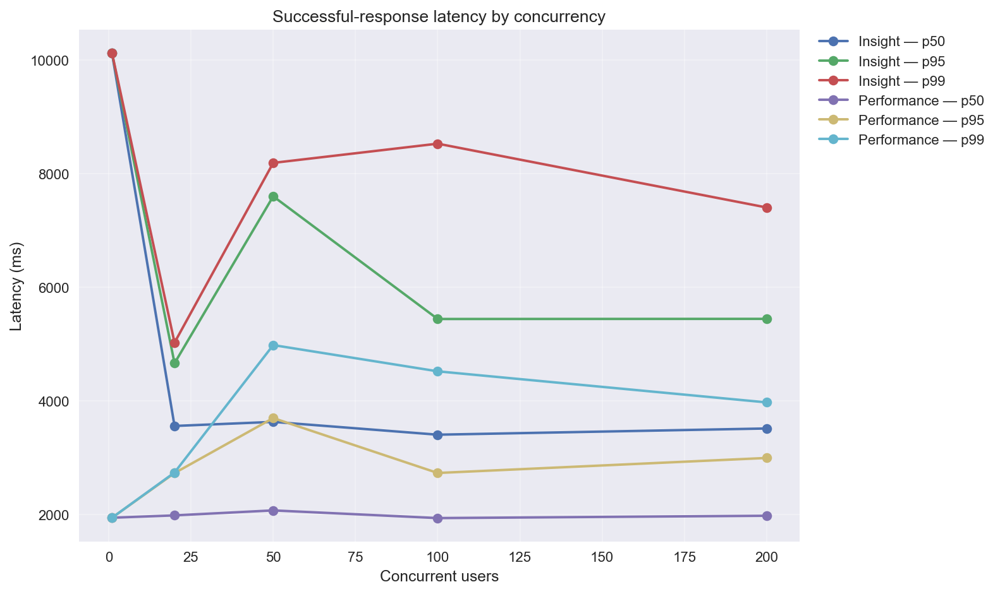

This chart shows successful-response latency as concurrency increases. The median represents typical successful latency, while p95 and p99 expose tail behavior. Rising tail latency indicates that some successful requests are becoming slower under the tested burst pressure. Failed requests are excluded and reported separately.

### Successful Throughput By Concurrency

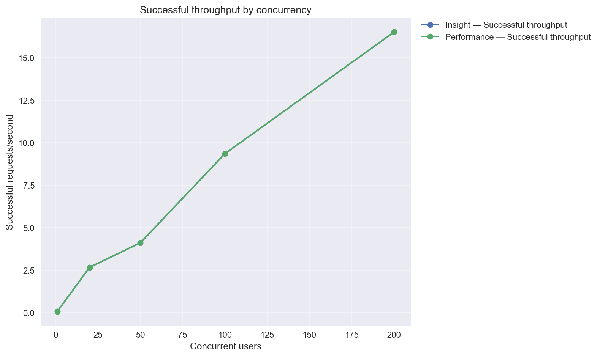

This chart shows successful throughput separately for each mode. Each value is the number of successful requests for that mode divided by the shared stage duration. The aggregate stage throughput is the combined successful throughput of both modes. Insight and Performance lines may overlap when both modes complete the same number of requests within the same shared stage duration. Higher throughput means more successful work completed during the measured burst, but it does not establish the service's maximum sustainable capacity.

### Transport Success Rate By Concurrency

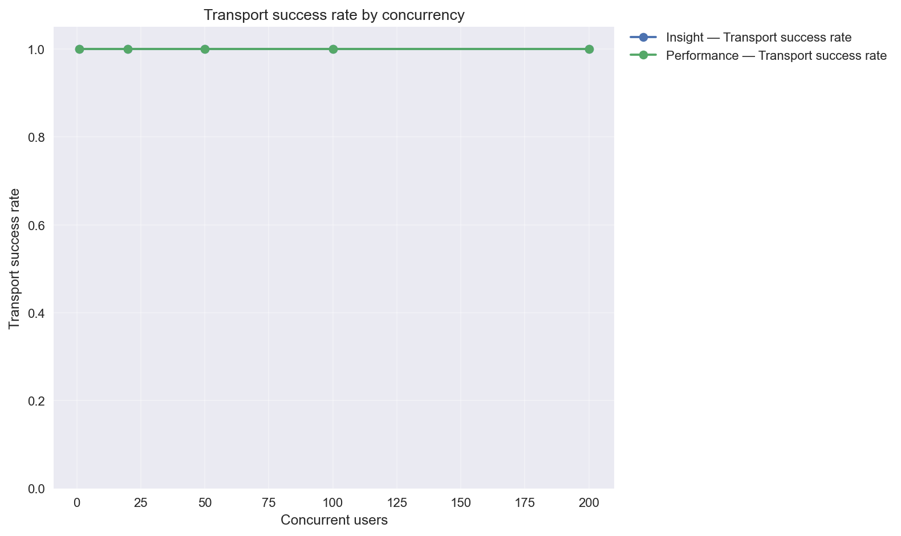

This chart shows the proportion of attempted scored requests that completed successfully at the transport and API-response level. It measures operational reliability, not whether the returned safety reasoning was semantically correct.

### Response Anomaly Rate By Concurrency

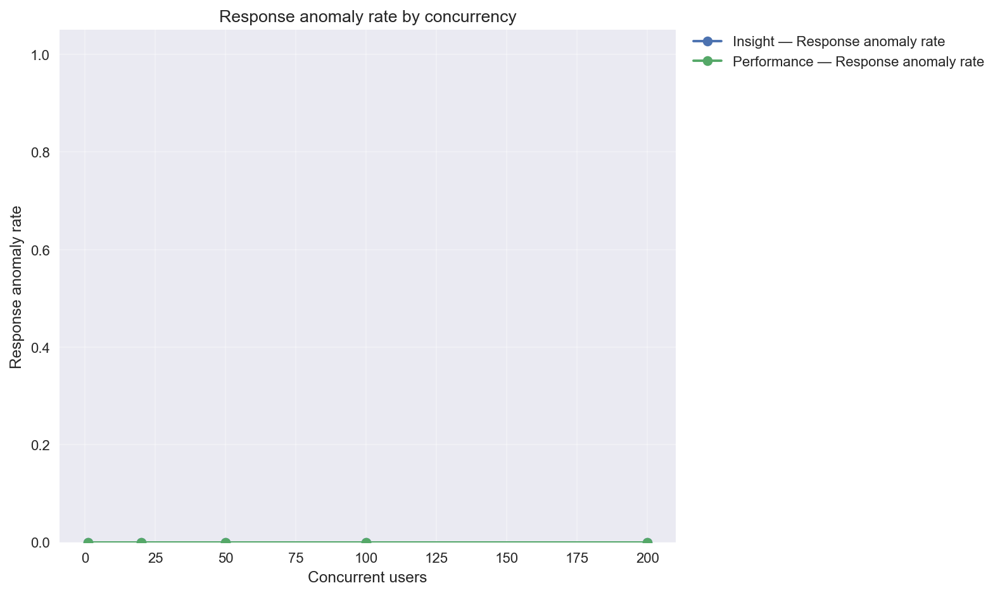

This chart shows the proportion of transport-successful scored responses that violated configured structural expectations, such as missing observations or predictions. A zero rate means no configured response-shape anomaly was detected; it does not establish semantic correctness.

### Recovery Latency Relative To Baseline

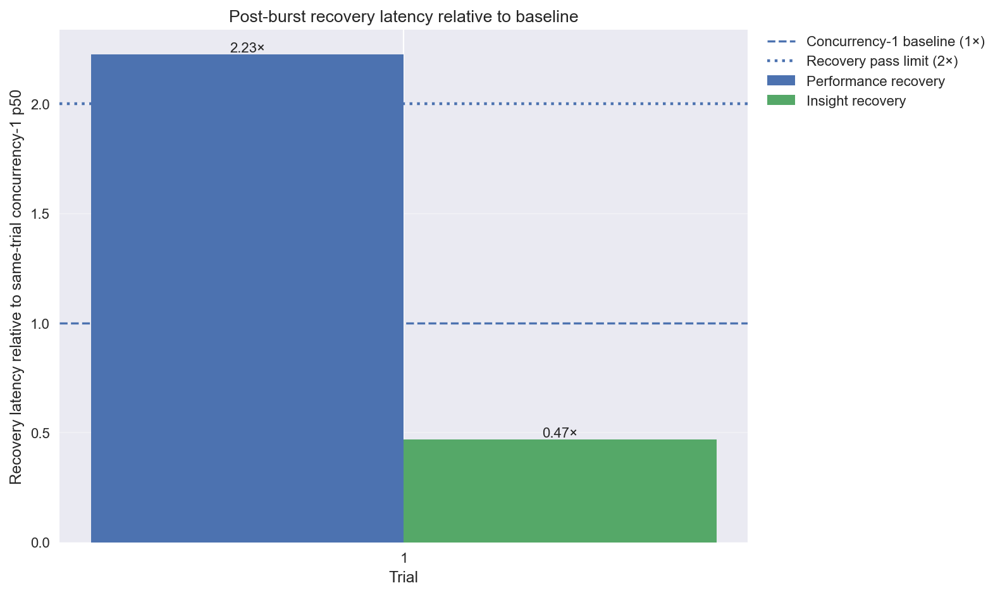

Each pair of bars represents the post-burst recovery probes sent after a trial's final scored concurrency stage: one probe for Performance mode and one for Insight mode. Each bar is the recovery-probe latency divided by that same mode's concurrency-1 p50 latency from the same trial. The concurrency-1 p50 is the same-trial baseline: a local reference for the mode's typical successful latency before the higher-concurrency burst. The 1× line means the recovery probe completed at exactly the baseline latency. A value below 1× means the probe completed faster than its baseline reference. A value between 1× and 2× means it was slower than baseline but remained within the configured recovery rule. The 2× line is the configured maximum recovery latency. A value above 2× fails the latency portion of the recovery check. Passing this check is evidence of short-window post-burst responsiveness, not proof of sustained-load or production resilience.

### Successful latency distribution — concurrency 20, Insight

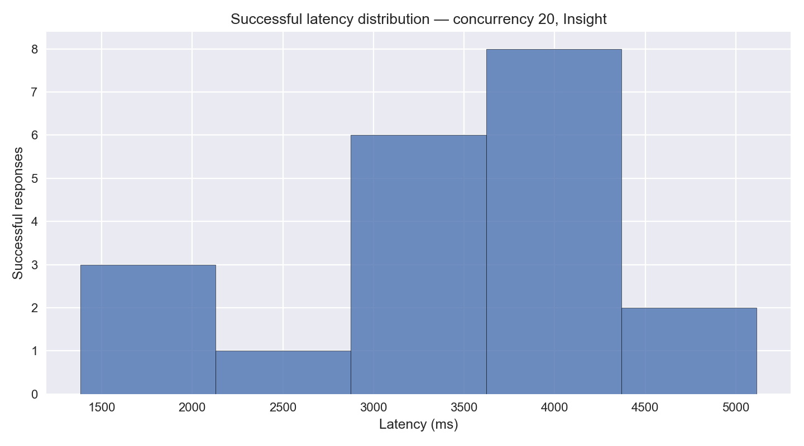

This histogram shows the distribution of successful request latencies for one mode at one concurrency level. Taller bars indicate latency ranges containing more successful responses. A narrow concentration suggests relatively consistent response times, while a wider or right-skewed distribution indicates greater variability or a slower latency tail. Failed requests are excluded and reported separately.

### Successful latency distribution — concurrency 20, Performance

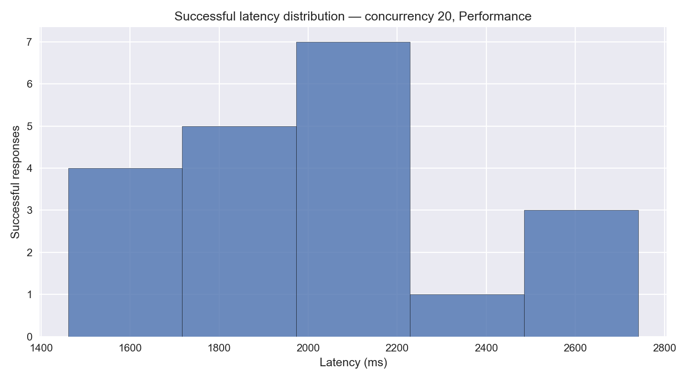

This histogram shows the distribution of successful request latencies for one mode at one concurrency level. Taller bars indicate latency ranges containing more successful responses. A narrow concentration suggests relatively consistent response times, while a wider or right-skewed distribution indicates greater variability or a slower latency tail. Failed requests are excluded and reported separately.

### Successful latency distribution — concurrency 50, Insight

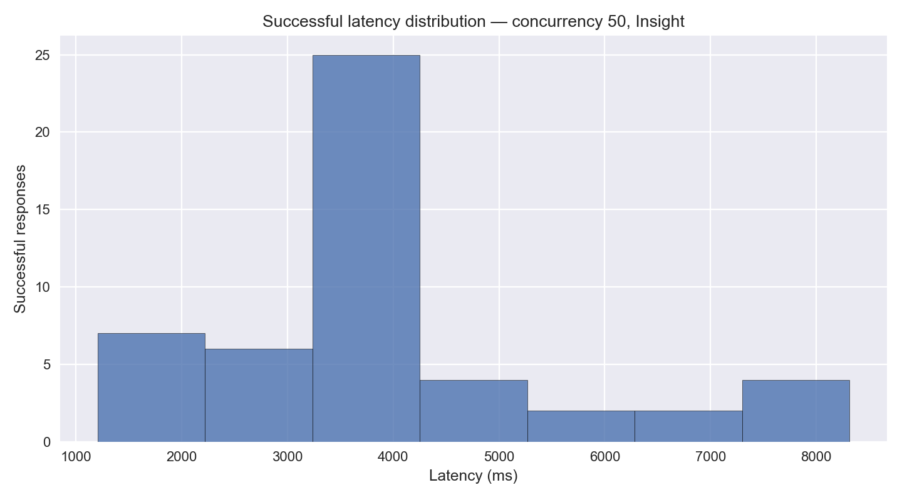

This histogram shows the distribution of successful request latencies for one mode at one concurrency level. Taller bars indicate latency ranges containing more successful responses. A narrow concentration suggests relatively consistent response times, while a wider or right-skewed distribution indicates greater variability or a slower latency tail. Failed requests are excluded and reported separately.

### Successful latency distribution — concurrency 50, Performance

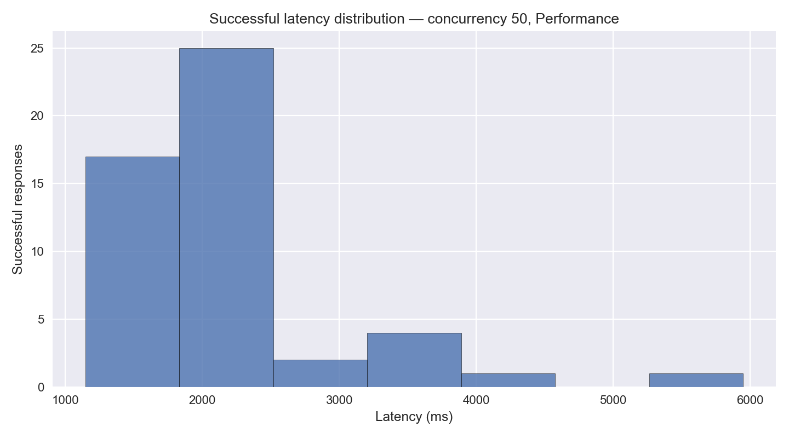

This histogram shows the distribution of successful request latencies for one mode at one concurrency level. Taller bars indicate latency ranges containing more successful responses. A narrow concentration suggests relatively consistent response times, while a wider or right-skewed distribution indicates greater variability or a slower latency tail. Failed requests are excluded and reported separately.

### Successful latency distribution — concurrency 100, Insight

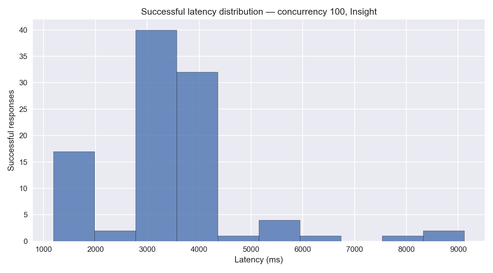

This histogram shows the distribution of successful request latencies for one mode at one concurrency level. Taller bars indicate latency ranges containing more successful responses. A narrow concentration suggests relatively consistent response times, while a wider or right-skewed distribution indicates greater variability or a slower latency tail. Failed requests are excluded and reported separately.

### Successful latency distribution — concurrency 100, Performance

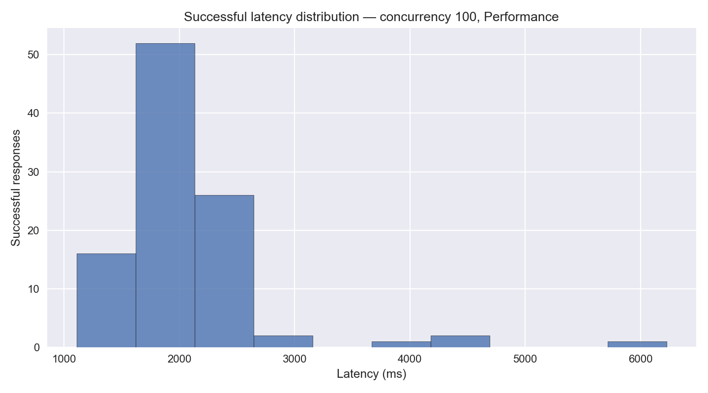

This histogram shows the distribution of successful request latencies for one mode at one concurrency level. Taller bars indicate latency ranges containing more successful responses. A narrow concentration suggests relatively consistent response times, while a wider or right-skewed distribution indicates greater variability or a slower latency tail. Failed requests are excluded and reported separately.

### Successful latency distribution — concurrency 200, Insight

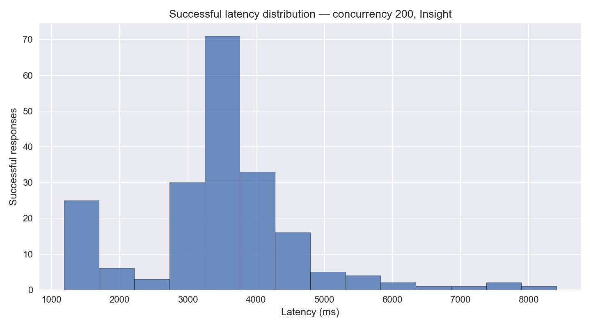

This histogram shows the distribution of successful request latencies for one mode at one concurrency level. Taller bars indicate latency ranges containing more successful responses. A narrow concentration suggests relatively consistent response times, while a wider or right-skewed distribution indicates greater variability or a slower latency tail. Failed requests are excluded and reported separately.

### Successful latency distribution — concurrency 200, Performance

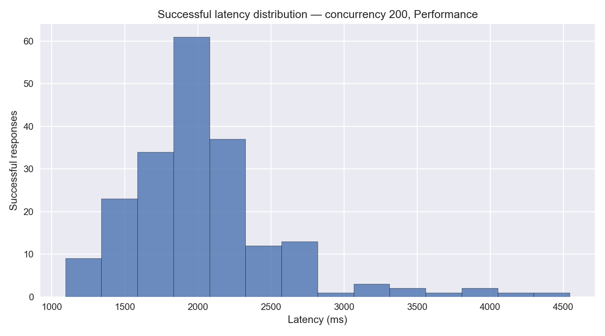

This histogram shows the distribution of successful request latencies for one mode at one concurrency level. Taller bars indicate latency ranges containing more successful responses. A narrow concentration suggests relatively consistent response times, while a wider or right-skewed distribution indicates greater variability or a slower latency tail. Failed requests are excluded and reported separately.

For a single-trial run or a group with few observations, percentile and
distribution views are descriptive rather than stable capacity estimates.

## 8. Recovery assessment

The recovery result for this run was **failed**.

Under the configured recovery rule, a passed result requires both modes to:

1. complete successfully;
2. return no configured response-shape anomaly; and
3. complete within twice their respective same-trial concurrency-1
   p50 latency baselines.

Recorded recovery ratios: trial 1 Performance: 2.23× baseline; trial 1 Insight: 0.47× baseline.

The following recovery baselines contain only one successful concurrency-1 observation: trial 1 Insight, trial 1 Performance. In those cases, the reported p50 baseline is equal to that single request latency. The resulting recovery ratios should be interpreted as diagnostic signals rather than stable latency estimates.

The service remained available after the burst, but did not fully satisfy the configured short-window recovery rule. Recorded recovery failures: trial 1: Performance exceeded its configured 2× latency limit. This is a diagnostic recovery signal, not evidence of a transport outage or a production-resilience certification.

Recovery requests are excluded from all scored summaries.

## 9. Response anomalies

No configured response anomalies were detected among transport-successful scored responses.

No anomaly-specific follow-up is required for this run.

## 10. Limitations and claim boundaries

- This benchmark measures live Inhibitor API latency, successful throughput, transport reliability, response-shape anomalies, configured workload expectations, behavior across the configured concurrency stages, and short-window recovery behavior.
- It does not measure sustained-load endurance, soak behavior, production autoscaling, disaster recovery, semantic correctness of observations or predictions, human-label agreement, full agent trajectory overhead, sandbox enforcement, controller enforcement, or whether an unsafe action was prevented.
- It does not compare simulated client or agent behavior with Inhibitor versus without Inhibitor.
- Recovery probes are lightweight diagnostics and do not constitute disaster-recovery or production resilience certification.
- The timing values, concurrency levels, and recovery threshold are benchmark protocol choices, not universal service-level objectives.

## 11. Evidence artifacts

- `run_manifest.json`
- `scenario_manifest.json`
- `request_records.jsonl`
- `request_records.csv`
- `scored_request_records.jsonl`
- `recovery_request_records.jsonl`
- `stage_metadata.csv`
- `trial_metadata.csv`
- `per_trial_summary.csv`
- `cross_trial_summary.csv`
- `recovery_summary.csv`
- `anomaly_summary.csv`
- `anomaly_breakdown.csv`
- `benchmark_report.md`
- `report_manifest.json`
- `plots/`

The canonical request-level evidence is preserved in
`request_records.jsonl`. The scored-only and recovery-only JSONL files are
convenience subsets for manual inspection and downstream analysis. CSV
files provide flattened views, manifests record workload and run
provenance, and summaries and plots provide deterministic reporting views.

