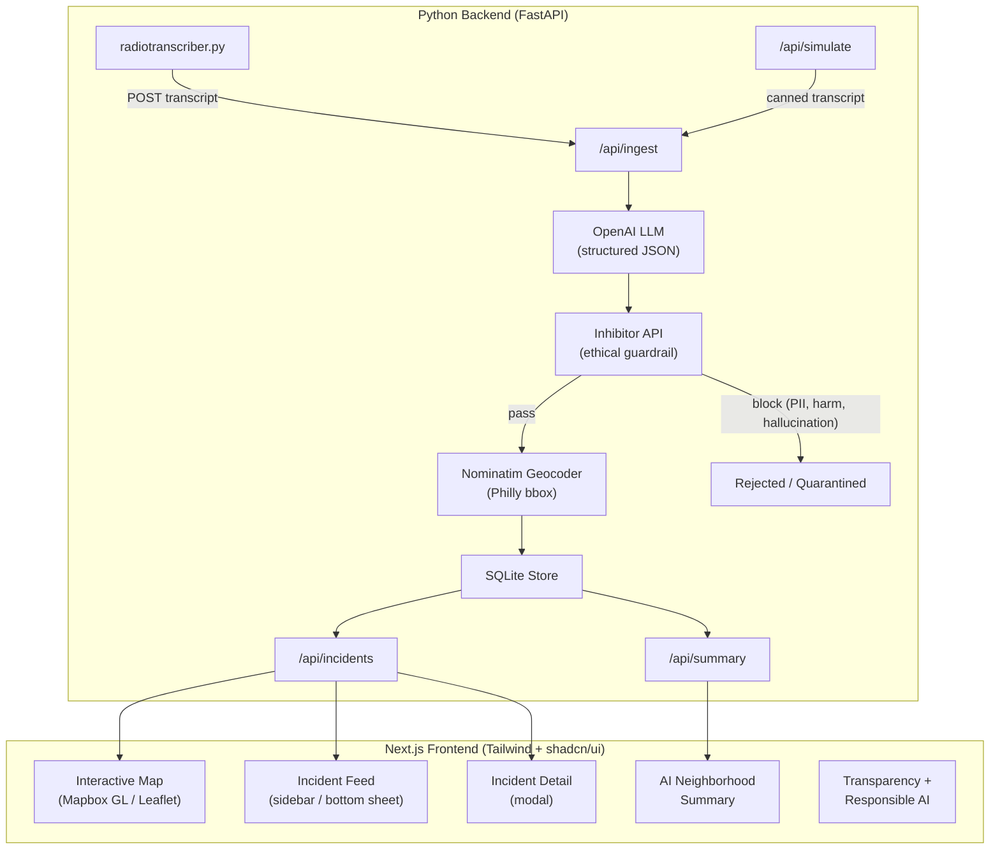

# Philly Pulse — Hackathon Build Plan

> **Philly Codefest 2026** | April 11-12 | Theme: *Building AI for Philly's Future*
>
> Canonical copy: [docs/philly-pulse-plan.md](philly-pulse-plan.md)

## The Pitch

**Philadelphia residents deserve to know what's happening in their neighborhoods in real time.** Police scanner audio is inaccessible — jargon-heavy, requires expensive equipment, and impossible to visualize spatially. **PhillyPulse** uses AI at every layer to turn raw radio audio into an interactive, real-time safety map that any Philadelphian can use from their phone.

## Hackathon Judging Alignment

| Criterion | Points | How we score |
|-----------|--------|--------------|
| Addresses the challenge | 25 | AI at every pipeline stage; Philly-specific; responsible AI transparency |
| How much built during event | 20 | Full-stack: Python backend + Next.js frontend + live transcriber integration |
| Market viability | 10 | Comparable to Citizen app ($1B+); free map + premium alerts; B2B for real estate/insurance |
| Presentation quality | 15 | Polished mobile UI, live demo with simulate fallback, clear narrative arc |

### Sponsor Prize Targets

- **Applied AI Studio — Challenge 2: Inhibitor Innovation ($1,000)** — "Build an AI system using Inhibitor." We integrate the [Inhibitor API](https://iaas.appliedai.studio/) into our ingest pipeline as a real-time ethical guardrail between LLM extraction and map display. Every incident is evaluated for privacy risks, potential public harm, and hallucination before it becomes a pin. Submission: single PR to [appliedaistudio/inhibitor-lab](https://github.com/appliedaistudio/inhibitor-lab) team workspace.
- **DEI** — Democratizes safety information: scanner intel was historically gatekept behind equipment and jargon. PhillyPulse makes it accessible to ALL Philadelphians. Stretch: add Spanish language toggle via LLM translation.
- **Comcast** — Explore integration angle if Comcast APIs available at event.

## Data Source (locked)

- **Map pins** come **only** from: Broadcastify stream -> [radiotranscriber.py](../radiotranscriber.py) (Whisper STT) -> HTTP ingest -> **LLM structured extraction** (required). There is **no** OpenDataPhilly / Carto / PPD bulk crime API.
- **LLM is not optional.** If the API key is missing or the model fails, return a clear error / empty map with explanation. Never silently fall back to another source.
- **Coordinates:** LLM outputs a human `location_text` (intersection, block, landmark). Resolved to lat/lng via **Nominatim geocoder** restricted to a **Philadelphia bounding box** — this is not the same as ingesting a city crime dataset.

## Risks / Disclaimers

- Audio + STT + LLM + geocode = **high false-positive / wrong-pin rate**. The UI must label every pin **"UNVERIFIED"** and cite **Broadcastify [terms](https://www.broadcastify.com/terms/)**.
- **Not** real-time 911. **Not** official police data. The transparency page must make this unmistakably clear.

## Inhibitor Integration (Applied AI Studio — Challenge 2)

The [Inhibitor API](https://iaas.appliedai.studio/) is an ethical guardrail service from Applied AI Studio. It evaluates an AI system's "thought chain" for risks **before** the system acts. We integrate it as a gate between LLM extraction and map pin creation.

### API Details

- **Endpoint:** `POST https://iaas.appliedai.studio/check`
- **Auth:** `X-API-Key` header (request from Applied AI Studio on Discord)
- **Mode:** `performance` (fast, flag-only — suitable for real-time ingest pipeline)
- **Logs:** `GET /logs` returns an audit trail of all evaluations (useful for the transparency page)

### Integration Point

After the LLM extracts structured incident data from a transcript, and **before** geocoding + storing it, pass the extraction through Inhibitor:

```python
response = httpx.post("https://iaas.appliedai.studio/check",
    headers={"X-API-Key": INHIBITOR_API_KEY},
    json={
        "thought_chain": [
            {
                "role": "human",
                "content": f"Police scanner transcript: '{raw_transcript}'"
            },
            {
                "role": "agent",
                "content": (
                    f"Extracted incident: category={severity_category}, "
                    f"location={location_text}, confidence={confidence}. "
                    f"Preparing to display on public safety map as UNVERIFIED incident."
                )
            }
        ],
        "mode": "performance"
    })
```

### What Inhibitor Catches

- **PII exposure** — Transcript mentions a victim's name, specific apartment number, or other identifying details that shouldn't be on a public map.
- **Potential public harm** — Unverified active shooter with low confidence that could cause panic if displayed.
- **Hallucinated content** — LLM extraction that doesn't match the transcript or contains fabricated details.
- **Ethically sensitive content** — Incidents involving minors, mental health crises, or other situations where public display could cause harm.

### Behavior on Flag

- If Inhibitor **passes**: proceed to geocode and store. The incident appears on the map.
- If Inhibitor **blocks**: store the incident with `inhibitor_status: "blocked"` and the Inhibitor reasoning. Do NOT display on the map. Log it for the audit dashboard.
- If Inhibitor is **unavailable** (timeout/error): fall back to displaying with an extra caution badge, or queue for retry. Don't silently skip the check — log the bypass.

### Audit Trail (Transparency Page)

The Inhibitor `/logs` endpoint returns a paginated audit trail of all evaluations. Surface this on the transparency page: "X incidents evaluated, Y blocked by ethical guardrail, Z displayed." This is a powerful demo moment — show the judges that the AI system has real-time ethical oversight, not just disclaimers.

### Store Schema Addition

Add to the incidents table: `inhibitor_status` (enum: `passed`, `blocked`, `bypassed`), `inhibitor_reason` (text, nullable).

## What Already Exists

- [radiotranscriber.py](../radiotranscriber.py) — Broadcastify stream, VAD, faster-whisper, hallucination cleanup, log write, optional MQTT ([mqtt_publisher.py](../mqtt_publisher.py)).

## Architecture



## Severity and Time Decay

### Severity Categories (LLM -> preset mapping)

The LLM classifies each dispatch-relevant transcript line into a **closed enum**. A deterministic mapping converts that to a numeric severity — no free-floating "model picks 1-10."

**LLM structured output fields:**
- `is_dispatch_relevant` (bool)
- `severity_category` — one of: `violent_weapon`, `violent_no_weapon`, `shots_heard`, `robbery`, `burglary_in_progress`, `medical_priority`, `medical_other`, `fire_hazmat`, `traffic_crash_injury`, `traffic_crash_no_injury`, `disorder`, `admin_or_noise`
- `location_text` — intersection, block, or landmark
- `confidence` — 0.0 to 1.0

`philly_pulse/data/severity_categories.yaml` maps each category to an **S_base** on [0, 1].

### Time Decay

Each incident has `reported_at` (UTC). The recency weight decays exponentially:

$$W_{\mathrm{time}}(\Delta t) = \exp\left(-\frac{\Delta t}{\tau}\right)$$

where $\tau$ = configurable time constant (`tau_hours` in config, e.g. 6-12h for demo).

### Effective Pin Weight

$$W_{\mathrm{eff}} = S_{\mathrm{base}} \cdot \exp\left(-\frac{\Delta t}{\tau}\right) \cdot C$$

where $C = \mathrm{clip}(\texttt{confidence}, 0.3, 1.0)$. This drives pin opacity/color intensity and heatmap aggregation.

### Future Work (mention in slides, don't build during hackathon)

Priority is getting incident data accurately onto the map first. Everything below depends on that foundation being solid.

- **Safe route generation** — The headline post-MVP feature. Given an origin and destination, query a routing engine (OSRM or Mapbox Directions) for candidate walking/biking/driving routes, then score each route segment by proximity to active incident pins (sum of $W_{\mathrm{eff}}$ within a kernel radius along the polyline). Surface the safest option to the user, or color-code segments of a single route by relative danger level. This is the feature that turns PhillyPulse from a passive map into an active decision-making tool — and it's a strong "what's next" demo slide.
- **District-level fade multipliers** from published PPD response-time data (faster response area -> faster pin decay).
- These are compelling product vision slides but not worth building until the core map + ingest pipeline is proven accurate and reliable.

## Frontend (Next.js + Tailwind + shadcn/ui)

### Stack

| Tool | Purpose |
|------|---------|
| Next.js (App Router) | React framework, SSR, easy Vercel deploy |
| Tailwind CSS | Utility-first styling, dark mode, mobile-first |
| shadcn/ui | Beautiful pre-built components (cards, dialogs, sheets, badges) |
| react-map-gl or react-leaflet | Map rendering with smooth animations |
| Framer Motion | Subtle UI animations for demo polish |

### Key Screens

1. **Landing / Hero** — Philly skyline imagery, tagline ("Real-time community safety awareness, powered by AI"), prominent "Open Map" CTA. Brief explanation of what PhillyPulse does.

2. **Live Map** (main screen) — Full-screen interactive map of Philadelphia. Pins color-coded by severity (red = violent, orange = property, yellow = traffic, blue = medical). Pulsing animation on recent incidents. Cluster markers when zoomed out. Filter toggles by category.

3. **Incident Feed** — Desktop: scrollable sidebar. Mobile: swipeable bottom sheet (like Google Maps). Each item shows: timestamp, category icon, location text, AI confidence badge. Tapping scrolls to the pin on the map.

4. **Incident Detail Modal** — Tap a pin or feed item. Shows: original transcript excerpt, AI-extracted fields, severity category + confidence, "UNVERIFIED — sourced from public radio scanner via AI transcription" badge, timestamp.

5. **Neighborhood Summary** — AI-generated natural language (via `/api/summary`): "Center City has seen 3 incidents in the last 2 hours, including a traffic crash and a medical call. Overall activity is moderate." Refreshes periodically.

6. **About / Transparency** — How the AI pipeline works (diagram), data source explanation, Broadcastify terms link, responsible AI statement, "not a replacement for 911" disclaimer, link to GitHub repo. **Inhibitor audit stats**: "X incidents evaluated, Y blocked by ethical guardrail" — pulled from Inhibitor `/logs` or local store counts.

### Mobile-First Design

- Bottom sheet for incident feed (swipe up)
- Floating action buttons for category filters
- Touch-friendly map interactions (tap pin -> detail sheet)
- Responsive breakpoints: mobile-first, then tablet, then desktop sidebar layout
- PWA manifest: installable on phone home screens (great demo moment — "add to home screen")

### Dark Mode

Default to dark mode for the map view — looks dramatically better in demos and is easier on the eyes for a safety app used at night.

## Backend (FastAPI)

### Package Layout

| File | Role |
|------|------|
| `philly_pulse/__init__.py` | Package init |
| `philly_pulse/server.py` | FastAPI app: `POST /api/ingest`, `GET /api/incidents`, `GET /api/health`, `POST /api/simulate`, `GET /api/summary` |
| `philly_pulse/store.py` | SQLite CRUD. Schema: `id`, `reported_at`, `raw_text`, `severity_category`, `s_base`, `location_text`, `lat`, `lng`, `confidence`, `geocode_status`, `inhibitor_status`, `inhibitor_reason` |
| `philly_pulse/llm.py` | OpenAI structured extraction. Strict JSON: `is_dispatch_relevant`, `severity_category` (closed enum), `location_text`, `confidence`. Reject non-relevant lines. |
| `philly_pulse/inhibitor.py` | Wrapper for Applied AI Studio Inhibitor API. Builds thought chain from transcript + extraction, calls `POST /check` in performance mode. Returns pass/block + reason. Graceful fallback on timeout. |
| `philly_pulse/geocode.py` | Nominatim `search` with `viewbox`/`bounded=1` for Philly. Rate-limit friendly (1 req/s). Cache by normalized `location_text`. |
| `philly_pulse/weights.py` | Load S_base from YAML, compute W_eff per pin at query time. |
| `philly_pulse/data/severity_categories.yaml` | Preset S_base per category. |
| `philly_pulse/data/philly_broadcastify_feeds.json` | Allowlisted Philadelphia feed IDs + labels. |
| `philly_pulse/data/seed_incidents.json` | Pre-built demo data: 15-20 realistic incidents across Philly neighborhoods. |
| `philly_pulse/bridge.py` | Non-blocking POST from transcriber to bridge_url. |

### API Endpoints

**`POST /api/ingest`** — Accepts `{ "text": "...", "timestamp": "..." }`. Runs LLM extraction -> Inhibitor check -> geocode -> store. Returns the created incident, an Inhibitor block reason, or an LLM rejection reason.

**`GET /api/incidents`** — Returns all incidents with computed `w_eff` for the current time. Supports `?since=` (ISO timestamp) and `?category=` filters. Powers the map and feed.

**`POST /api/simulate`** — Triggers ingest with a random canned Philadelphia dispatch transcript. For demo reliability.

**`GET /api/summary`** — Returns an AI-generated natural language summary of recent incident activity by neighborhood. Simple: query last N incidents, pass to LLM with a summarization prompt.

**`GET /api/health`** — Returns service status + whether LLM key is configured.

### CORS

Enable CORS for the Next.js dev server (`localhost:3000`) and the production domain.

## Transcriber Bridge

Extend `config.yaml.example`:

```yaml
philly_pulse:
  enabled: false
  bridge_url: "http://127.0.0.1:8765/api/ingest"
```

In `radiotranscriber.py`, after writing a line to the log, if `philly_pulse.enabled`, POST the transcript text via `bridge.py` in a **daemon thread** (non-blocking, fire-and-forget with retry).

### Philadelphia Broadcastify Feeds

Store curated feed IDs in `philly_pulse/data/philly_broadcastify_feeds.json`:

```json
[
  { "feed_id": "NNNNN", "label": "Philadelphia Police - Citywide", "verified_date": "2026-04-11" }
]
```

Populated manually from [broadcastify.com](https://www.broadcastify.com) (PA -> Philadelphia). No automated scraping.

## Demo Strategy (Critical for Winning)

### The Problem

Broadcastify streams can lag, Whisper takes seconds per segment, LLM calls can timeout. If any link fails during a 2-minute live demo, the presentation is dead.

### The Solution

1. **Seed data** — Pre-load SQLite with 15-20 realistic incidents spread across Philadelphia neighborhoods (Center City, University City, Kensington, North Philly, etc.) with varied categories and timestamps.
2. **Simulate endpoint** — `POST /api/simulate` picks a random canned dispatch transcript, runs it through the REAL LLM + geocode pipeline, and the new pin appears on the map in real time. This proves the AI works without depending on Broadcastify.
3. **Simulate button** — In the UI (behind an admin toggle or just a floating button), click to fire `/api/simulate` and watch a new pin appear with animation.
4. **Demo flow script:**
   - Open the app on laptop (show desktop view)
   - "Here's what Philadelphia looks like right now" (seeded data on map)
   - Click simulate -> watch new incident appear -> tap into detail -> show AI extraction
   - Show Inhibitor in action: simulate a transcript with PII or harmful content -> show it being blocked, explain the ethical guardrail
   - Pull up the app on phone -> show mobile layout, bottom sheet, installable PWA
   - Switch to neighborhood summary -> show AI-generated text
   - Show transparency page -> responsible AI + Inhibitor audit stats
5. **Backup plan** — If the API is down: pre-recorded 30-second screen capture video embedded in slides.

## Presentation Outline (5 min + 3 min Q&A)

| Slide | Duration | Content |
|-------|----------|---------|
| 1. The Problem | 30s | "Scanner audio is inaccessible. Philadelphians deserve real-time neighborhood awareness." |
| 2. PhillyPulse | 30s | Product overview + architecture diagram. "AI at every layer." |
| 3. Live Demo | 120s | Map walkthrough, simulate an incident, mobile view, AI summary. |
| 4. AI Pipeline Deep Dive | 30s | Whisper -> LLM extraction -> geocoding -> severity decay. Show the structured JSON. |
| 5. Responsible AI + Inhibitor | 30s | Unverified labels, confidence scores, Inhibitor as real-time ethical guardrail (blocks PII/harm/hallucination before display), audit trail on transparency page. |
| 6. Market + Future | 30s | User personas (residents, drivers, tourists). Citizen app comparable. Premium alerts, B2B for real estate/insurance. Future: district-level decay, route scoring, multi-city expansion. |

## Market Viability (10 judging points)

- **Primary users:** Philadelphia residents, commuters, delivery/rideshare drivers, tourists, community organizations.
- **Comparable:** Citizen app (valued $1B+), Nextdoor safety alerts — but PhillyPulse is AI-first, Philly-specific, and transparent about its data sources.
- **Free tier:** Map view, incident feed, neighborhood summaries.
- **Premium tier:** Push notifications for your area, route safety scoring, historical trend analysis.
- **B2B:** Neighborhood safety scores for real estate platforms, risk data for insurance (Penn Mutual is a sponsor), city government dashboards.
- **Domain:** philladelphiapulse.com — deploy on Vercel for the demo.

## Dependencies

**Backend** (`requirements-philly-pulse.txt`):
```
fastapi
uvicorn[standard]
httpx
openai
pyyaml
```

**Frontend** (`frontend/package.json`):
```
next, react, react-dom, tailwindcss, @radix-ui/*, react-map-gl (or react-leaflet),
framer-motion, lucide-react
```

Transcriber deps unchanged: `numpy`, `scipy`, `faster-whisper`, `webrtcvad`, `pyyaml`, `paho-mqtt`.

## Run Commands

```bash
# Backend
pip install -r requirements-philly-pulse.txt
export OPENAI_API_KEY=...
export INHIBITOR_API_KEY=...   # from Applied AI Studio (Discord DM)
uvicorn philly_pulse.server:app --reload --port 8765

# Frontend
cd frontend
npm install
npm run dev          # localhost:3000

# Transcriber (optional — for live data beyond seeded demo)
python radiotranscriber.py   # with philly_pulse.enabled in config.yaml
```

## Implementation Order (Hackathon Sprint)

### Phase 1: Core Backend (3-4 hours)
1. `severity_categories.yaml` with S_base values.
2. `store.py` — SQLite schema + CRUD (include `inhibitor_status`, `inhibitor_reason` columns).
3. `llm.py` — OpenAI structured extraction with closed enum.
4. `inhibitor.py` — Wrapper for Inhibitor `/check` endpoint. Build thought chain from transcript + extraction, call in `performance` mode, return pass/block + reason.
5. `geocode.py` — Nominatim with Philly bounding box.
6. `weights.py` — S_base lookup + W_eff computation.
7. `server.py` — FastAPI with `/api/ingest` (LLM -> Inhibitor -> geocode -> store), `/api/incidents`, `/api/health`, `/api/simulate`, `/api/summary`.
8. `seed_incidents.json` — 15-20 realistic Philly incidents.
9. Verify: POST a synthetic transcript -> LLM -> Inhibitor pass -> geocode -> GET shows pin. Also verify: POST a transcript with PII -> Inhibitor blocks -> incident stored as blocked, not displayed.

### Phase 2: Frontend (4-5 hours)
1. Scaffold Next.js + Tailwind + shadcn/ui.
2. Map component with pins from `/api/incidents` (color-coded, animated).
3. Incident feed (sidebar on desktop, bottom sheet on mobile).
4. Incident detail modal.
5. Neighborhood summary panel (from `/api/summary`).
6. About / transparency page.
7. Dark mode, responsive breakpoints, PWA manifest.

### Phase 3: Transcriber Bridge (1 hour)
1. `bridge.py` — non-blocking POST.
2. `config.yaml.example` — add `philly_pulse` block.
3. Wire into `radiotranscriber.py` after log write.
4. `philly_broadcastify_feeds.json` with Philly feed IDs.

### Phase 4: Demo + Polish (2-3 hours)
1. Simulate button in UI wired to `/api/simulate`.
2. Test full pipeline end-to-end.
3. Mobile testing on actual phone.
4. Seed database with demo data for judging.
5. Prepare slides (6 slides max).
6. Rehearse demo flow (time it to 5 min).
7. Record backup demo video.

## Verification Checklist

- [ ] `POST /api/ingest` with realistic dispatch text -> LLM returns structured JSON -> Inhibitor passes -> geocode returns Philly point -> `GET /api/incidents` shows pin with correct fields.
- [ ] `POST /api/ingest` with PII-containing transcript -> Inhibitor blocks -> incident stored with `inhibitor_status: "blocked"` -> NOT shown on map.
- [ ] `POST /api/simulate` creates a new incident visible on the map within seconds.
- [ ] Frontend loads, displays seeded incidents on map, color-coded by severity.
- [ ] Tapping a pin opens detail modal with transcript, category, confidence, UNVERIFIED badge.
- [ ] Incident feed updates in real time (or on polling interval).
- [ ] `/api/summary` returns a coherent AI-generated neighborhood summary.
- [ ] Mobile layout works: bottom sheet, touch interactions, no horizontal scroll.
- [ ] Dark mode renders correctly on map and all components.
- [ ] Transparency page explains the full pipeline honestly, including Inhibitor audit stats (evaluated / blocked / displayed).
- [ ] With transcriber running (if Broadcastify available), new lines create new pins on the map.
